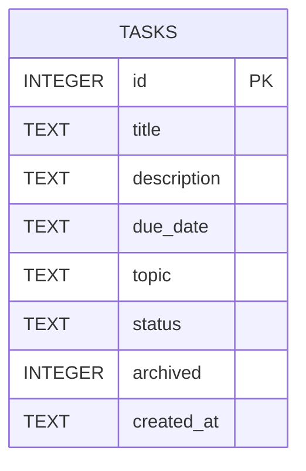

# Database Schema

The To-Do list application uses SQLite to store task data, and the database currently contains a single table.

## Entity Relationship Diagram

## Table: `tasks`

| Column | Data Type | Constraints | Description |
|--------|-----------|-------------|-------------|
| id | INTEGER | PRIMARY KEY, AUTOINCREMENT | Unique identifier for each task. |
| title | TEXT | NOT NULL | Title of the task. |
| description | TEXT | Optional | Additional details about the task. |
| due_date | TEXT | NOT NULL | Due date of the task. |
| topic | TEXT | NOT NULL | Category or topic of the task. |
| status | TEXT | NOT NULL, DEFAULT 'Todo' | Task status (`Todo`, `In-Progress`, `Complete`). |
| archived | INTEGER | NOT NULL, DEFAULT 0 | Indicates whether the task is archived (0 = No, 1 = Yes). |
| created_at | TEXT | NOT NULL, DEFAULT datetime('now') | Timestamp when the task was created. |

-This schema currently uses a tasks table.As a results there are no relationships or foreign keys constraints in the databse.All task infomation is stored within this table.
